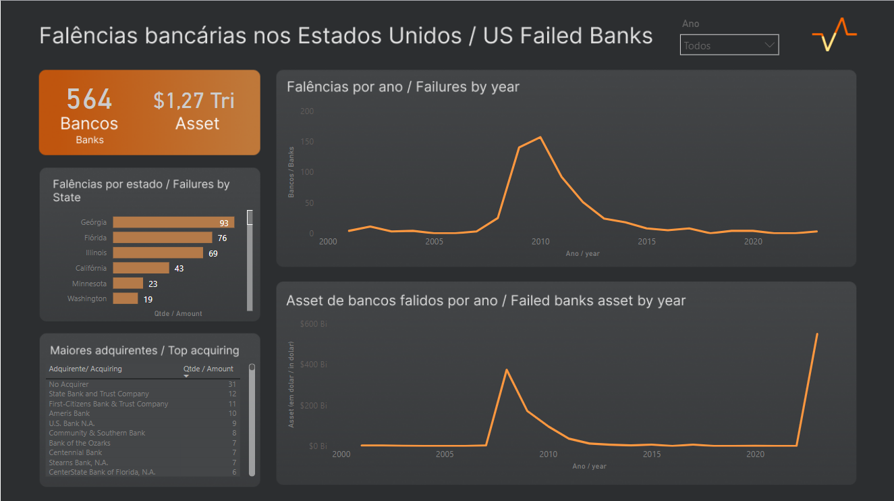

# Resumo do projeto | Project's summary

[PT] 

## Objetivo do projeto
A ideia deste projeto é monitorarmos o número de falências bancárias de bancos segurados pelo FIDC nos Estados Unidos. Este dado é alimentado pelo Federal Deposit Insurance Corporation (FIDC) e é atualizado sempre que um novo evento do tipo acontece. 

## O que a FIDC considera falência? 
* Uma falência bancária é o fechamento de um banco por uma agência reguladora bancária federal ou estadual. Geralmente, um banco é fechado quando não consegue cumprir suas obrigações com os depositantes e outros. Este trabalho trata da falência de "bancos segurados". O termo "banco segurado" significa um banco segurado pelo FDIC, incluindo bancos credenciados pelo governo federal, bem como a maioria dos bancos credenciados pelos governos estaduais. Um banco segurado deve exibir um sinal oficial do FDIC em cada caixa.

## Qual stack de dados foi utilizada?
* Através deste projeto tentamos explorar 3 ferramentas muito utilizadas no dia a dia de dados: python, google big query e Power BI. 

1. *Python*: foi utilizado para o processo ETL desse projeto (que de um modo geral seria simples). Com ele, conectamos na fonte de dados, tratamos a informação para o formato mais adequado ao Power BI e subimos a informação tratada para a núvem. 
2. *Google Big Query*: foi utilizado para armazenar as tabelas que foram tratadas no Python. Assim, temos o dado disponível em um ambiente cloud. 
3. *Power BI*: foi utilizado como "deploy" do projeto. Com ele, conectamos no Google Big Query, extraímos as informações e geramos as visualizações mais adequadas. 

*OBS: sabemos que o Power BI possui um recurso nativo para leitura de conteúdos WEB. Porém, o objetivo desse trabalho era testarmos uma estrutura mais robusta e com maiores possibilidades, o que, por nossa decisão, justificou a inclusão do Python e do Google Big Query neste escopo. Com estas outras duas ferramentas, nosso leque de possibilidades aumenta de forma exponencial, e ter essa stack testada será muito relevante para os projetos futuros.*

  

[EN]

## Project's goal
The idea of this project is to monitor the number of bank failures of banks insured by the FIDC in the United States. This data is fed by the Federal Deposit Insurance Corporation (FIDC) and is updated whenever a new such event occurs.

## What does the FIDC consider bankruptcy?
* A bank failure is the closing of a bank by a federal or state banking regulatory agency. Generally, a bank is closed when it fails to meet its obligations to depositors and others. This work deals with the bankruptcy of "insured banks". The term "insured bank" means a bank insured by the FDIC, including banks accredited by the federal government, as well as most banks accredited by state governments. An insured bank must display an official FDIC sign on each teller.

## Which data stack was used?
* Through this project we try to explore 3 tools that are very used in the daily life of data: python, google big query and Power BI.

1. *Python*: was used for the ETL process of this project (which in general would be simple). With it, we connect to the data source, process the information into the most appropriate format for Power BI and upload the treated information to the cloud.
2. *Google Big Query*: was used to store the tables that were handled in Python. Thus, we have the data available in a cloud environment.
3. *Power BI*: was used as a "deploy" for the project. With it, we connect to Google Big Query, extract the information and generate the most appropriate views.

*NOTE: We know that Power BI has a native resource for reading WEB content. However, the objective of this work was to test a more robust structure with greater possibilities, which, by our decision, justified the inclusion of Python and Google Big Query in this scope. With these other two tools, our range of possibilities increases exponentially, and having this stack tested will be very relevant for future projects.*
